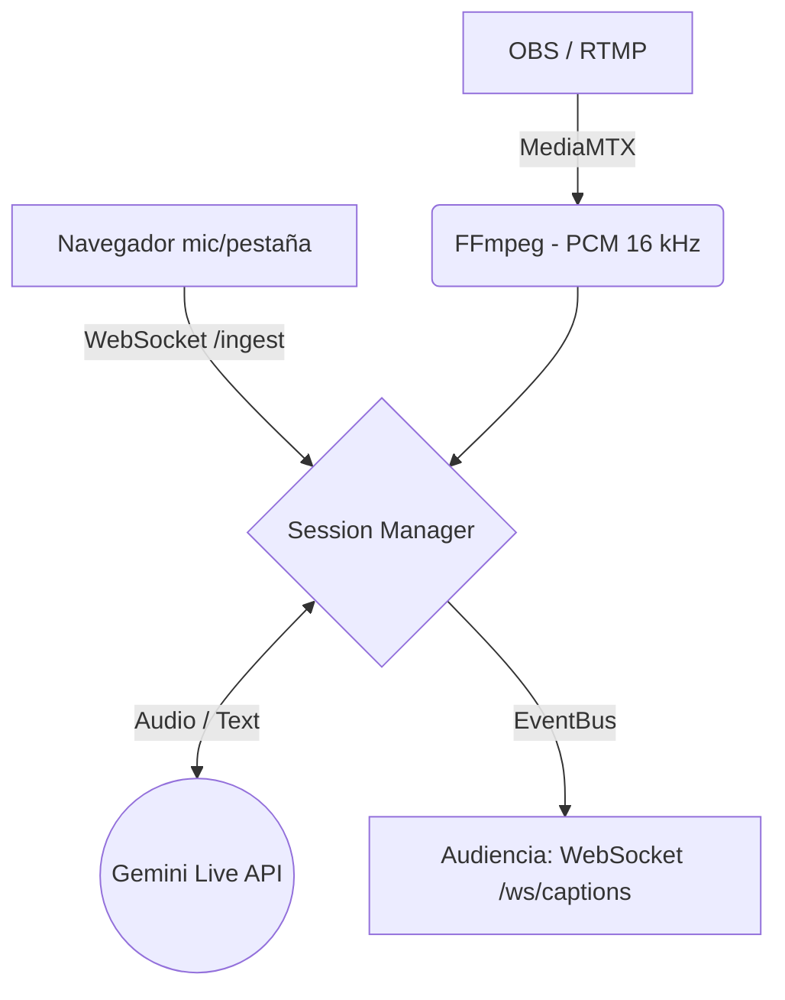

<div align="center">

# 🎙️ SIMULCAST
**Subtítulos simultáneos open-source a escala para conferencias**

*Transcripción y traducción en vivo mediante IA para decenas de sesiones en paralelo.*

[](./LICENSE)
[](https://www.python.org/)
[](https://fastapi.tiangolo.com/)
[](https://aistudio.google.com/)
[](https://www.docker.com/)

<br />

**Simulcast** captura audio en vivo desde un escenario (vía RTMP desde OBS o directamente desde el navegador) y genera subtítulos en tiempo real, ofreciendo **transcripción** en el idioma original y **traducción** simultánea (español, inglés, portugués). 

Diseñado para eventos de alta concurrencia como [Nerdearla](https://nerdearla.com), soporta **múltiples sesiones en paralelo** bajo una arquitectura ligera y resiliente.

</div>

---

<details>
<summary><b>🛠️ Ver Stack Tecnológico Completo</b></summary>
<br>

**Backend:**


**Inteligencia Artificial:**


**Frontend & Streaming:**


**DevOps:**


</details>

## 📋 Índice
- [Arquitectura](#-arquitectura)
- [Características Principales](#-características-principales)
- [Requisitos](#-requisitos)
- [Quickstart (Desarrollo)](#-quickstart-desarrollo)
- [Despliegue con Docker](#-despliegue-con-docker)
- [Configuración de Sesiones](#-configuración-de-sesiones)
- [Referencia de API](#-referencia-de-api)
- [Seguridad y Rendimiento](#-seguridad-y-rendimiento)

---

## 🏗 Arquitectura

El flujo de audio se procesa en tiempo real, distribuyendo los subtítulos a través de WebSockets para garantizar latencia ultra baja.


*(Si tu plataforma no soporta Mermaid, aquí tienes el [diagrama en texto clásico](#).)*

---

## ✨ Características Principales

- **🗣️ Transcripción y Traducción Live:** Conversión del idioma original y traducción al español en tiempo real (con opción a inglés/portugués).
- **🎛️ Multi-sesión Escalar:** Soporta más de 10 escenarios/sesiones en paralelo de forma configurable.
- **🔌 Flexibilidad de Ingesta:** Dos fuentes de audio nativas: **RTMP (OBS)** para producción, y **Navegador** para setups rápidos sin infraestructura extra.
- **📺 Interfaces Completas:**
  - **Programa público:** Grilla de sesiones para la audiencia.
  - **Player web:** Selector de sesión e idioma para el espectador.
  - **Monitor de producción (`/monitor`):** Telemetría en vivo (estado, latencia, errores).
  - **Overlay OBS (`/overlay`):** Página con fondo transparente para superponer subtítulos automáticos en OBS/vMix.
- **🛡️️ Alta Disponibilidad:** Compresión de contexto para charlas largas (evita cortes de API) y *session resumption*.
- **💾 Exportación de Datos:** Exporta el historial de la sesión en formatos estándar (`SRT`, `VTT`, `TXT`) mediante API REST.

---

## ⚙️ Requisitos

- **Python 3.11+** (o Docker para despliegue contenerizado).
- **FFmpeg** (requerido únicamente si utilizarás la ingesta RTMP).
- **API Key de Gemini** obtenida desde [Google AI Studio](https://aistudio.google.com/apikey).

---

## 🚀 Quickstart (Desarrollo)

Clona el repositorio y levanta el entorno en menos de un minuto:

```bash
# 1. Clonar y preparar entorno
git clone <repo-url> simulcast && cd simulcast
python -m venv .venv 
source .venv/bin/activate  # En Windows: .venv\Scripts\activate
pip install -r requirements.txt

# 2. Configurar variables de entorno y sesiones
cp .env.example .env
# ⚠️ Edita el archivo .env e inserta tu GEMINI_API_KEY

cp sessions.example.yaml sessions.yaml # Incluye 3 escenarios de ejemplo

# 3. Levantar el servidor
uvicorn server.main:app --host 0.0.0.0 --port 8000 --reload
```

### 🧭 Navegación del Proyecto Local:
- 🏠 **Landing & Docs:** `http://localhost:8000/`
- 📅 **Audiencia (Grilla):** `http://localhost:8000/program`
- 🎛️ **Operador (Ingesta Web):** `http://localhost:8000/operator`
- 📊 **Monitor (Producción):** `http://localhost:8000/monitor`
- 🎥 **Overlay OBS:** `http://localhost:8000/overlay/stage-1`

> **💡 Demo rápida sin OBS:**
> Ve a `/operator`, selecciona una sesión, haz clic en **Compartir audio** y selecciona una pestaña de tu navegador (ej. un video de YouTube). Luego abre `/program` en otra pestaña, entra a la sesión en vivo y verás los subtítulos generándose.

---

## 🐳 Despliegue con Docker

Para entornos de producción o pruebas sin dependencias locales:

```bash
cp .env.example .env          # Asegúrate de agregar GEMINI_API_KEY
cp sessions.example.yaml sessions.yaml

# Levantar servicios en segundo plano
docker compose up --build -d
```
* **API + Audiencia:** `http://TU_HOST:8000`
* **RTMP para OBS:** `rtmp://TU_HOST:1935/<session_id>` *(ej. rtmp://TU_HOST:1935/stage-1)*

---

## 🛠️ Configuración de Sesiones

Define tus escenarios en el archivo `sessions.yaml`. 

```yaml
sessions:
  - id: stage-1
    name: "Main Stage"
    source_language: en          # Opciones: en | es | pt | auto
    output_languages: [original, es]
```

*Nota sobre traducciones:* Actualmente cada conexión a Gemini Live entrega el audio `original` + una traducción. Para múltiples idiomas de destino, puedes duplicar la sesión temporalmente (soporte multi-traducción en desarrollo).

**Crear sesiones en Runtime vía API:**
```bash
curl -X POST http://localhost:8000/api/sessions \
  -H 'Content-Type: application/json' \
  -d '{"id":"stage-4","name":"Stage 4","source_language":"en","output_languages":["original","es"]}'
```

---

## 🔌 Referencia de API

Simulcast expone una API robusta para automatización y consumo:

### Endpoints REST

| Método | Ruta | Descripción |
|---|---|---|
| `GET` | `/api/health` | Estado general, modelos, sesiones en vivo y uptime. |
| `GET` | `/api/monitor` | Snapshot integral de telemetría (métricas + errores). |
| `GET` | `/api/sessions` | Listado de sesiones activas, workers e ingestas. |
| `POST` | `/api/sessions` | Crear una nueva sesión en runtime. |
| `PUT` | `/api/sessions/{id}` | Reconfigurar sesión existente (reinicia workers). |
| `GET` | `/api/sessions/{id}/export.srt`| Exportar historial. Soporta `?lang=es` y formatos `srt`, `vtt`, `txt`. |

### WebSockets

| Ruta | Descripción |
|---|---|
| `/ws/captions/{id}?lang=es` | Stream de subtítulos para la audiencia (`lang=all` para todo). |
| `/ws/ingest/{id}` | Ingesta de audio PCM desde el navegador (Operador). |
| `/ws/monitor` | Push en tiempo real de métricas al panel de monitoreo. |

<details>
<summary><b>Formato del Payload de Subtítulos (JSON)</b></summary>

```json
{
  "type": "caption",
  "session": "stage-1",
  "lang": "es",
  "text": "Hola, bienvenidos a Nerdearla",
  "final": true,
  "t": 1769000000.123,
  "id": "stage-1:es:42:ab12cd"
}
```
*Los eventos con `final: false` son parciales y la UI los actualiza dinámicamente usando el mismo `id`.*
</details>

---

## 🔒 Seguridad y Rendimiento

* **Escala:** 10 escenarios requieren ~10 conexiones simultáneas a Gemini Live. El cuello de botella principal será tu **cuota de API de Google**, no el hardware local. Modifica `SIMULCAST_MAX_SESSIONS` según tu límite.
* **Seguridad API:** Tu clave de Gemini **nunca** se expone al cliente. Toda la comunicación de IA ocurre Server-Side.
* **Despliegue Seguro:** El endpoint `/ws/ingest` y MediaMTX no tienen autenticación por defecto. Para producción, ubícalos detrás de una VPN, LAN privada o un Reverse Proxy con autenticación básica (Ver `docs/DEPLOY.md`).

---

## 🤝 Contribuir

¡Las PRs son bienvenidas! Revisa nuestra [Guía de Contribución (CONTRIBUTING.md)](./CONTRIBUTING.md) para conocer las convenciones del proyecto y el entorno de desarrollo. Al participar, aceptas nuestro [Código de Conducta](./CODE_OF_CONDUCT.md).

## 📄 Licencia

Este proyecto está licenciado bajo la **Apache License 2.0**. Consulta el archivo [LICENSE](./LICENSE) para más detalles.
